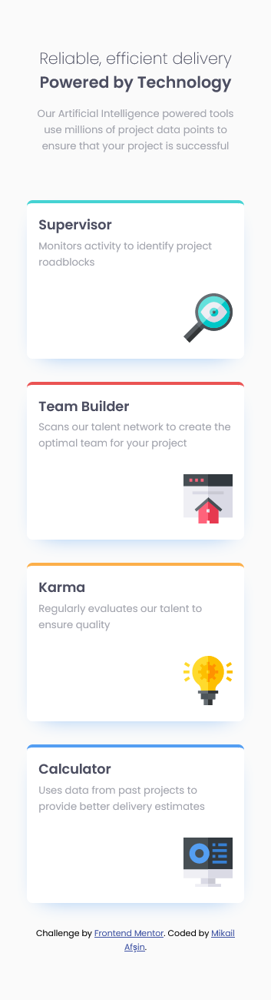
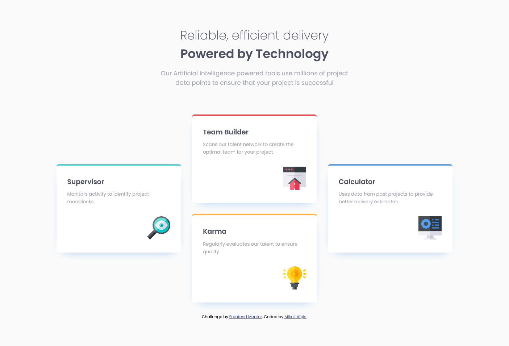

# Frontend Mentor - Four card feature section solution

This is a solution to the [Four card feature section challenge on Frontend Mentor](https://www.frontendmentor.io/challenges/four-card-feature-section-weK1eFYK).

## Table of contents

- [Overview](#overview)
  - [The challenge](#the-challenge)
  - [Screenshot](#screenshot)
  - [Links](#links)
- [My process](#my-process)
  - [Built with](#built-with)
  - [What I learned](#what-i-learned)
  - [Continued development](#continued-development)
- [Author](#author)
## Overview

### The challenge

Users should be able to:

- View the optimal layout for the site depending on their device's screen size

### Screenshot

**Mobile**


**Desktop**


### Links

- Solution URL: [GitHub](https://github.com/mikailafsin/frontend-mentor-four-card-feature-section-solution)
- Live Site URL: [Vercel](https://frontend-mentor-four-card-feature-section-solution-khaki.vercel.app)

## My process

### Built with

- HTML5 markup
- CSS custom properties
- Flexbox
- Mobile-first workflow

### What I learned

In this challenge I gained more control over using the `box-shadow` property.


```css
.card {
  ...
  ...
  ...
  ...
  ...
  box-shadow: 0 10px 30px -20px var(--blue-clr);
}
```

### Continued development

In future projects, I will practice more about the `box-shadow` property and focus on supporting the practice with different variations.

## Author

- Frontend Mentor - [@mikailafsin](https://www.frontendmentor.io/profile/mikailafsin)
- Instagram - [@mikail.afsin](https://www.instagram.com/mikail.afsin)